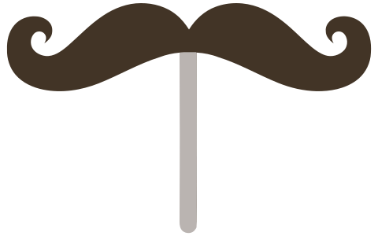

<section class="customCover">
  
  <h1 class="mainTitle"> The main goal of Web static template is do everything that is possible statically. Why it matters? </h1>

  

    <ul class="reasons">
      <li class="reason">
        Better for performance and as a consequence it's better for users.
        Сlient doesn't need do extra work in browser. All possible work is done when you build project
      </li>

      <li class="reason">
        Redivable. You are 100% sure that everything is generated correctly, independently of user's browsers
      </li>

      <li class="reason">
        Better for indexing your pages by search engines
      </li>

      <li class="reason">
        Your content will be available even client block JavaScript
      </li>
    </ul>
  

  <section class="otherReasons">
    <h2> Use your favorite tools out of the box </h2>

    

      

        
        
        
      

      

        
        
        
      

      

        
        
      

    

  </section>

  

    <a class="getStarted" href="#/?id=main-features"> Get started </a>
    <a class="github" href="https://github.com/sergey-pimenov/web-static-template">  Github </a>
  

</section>

