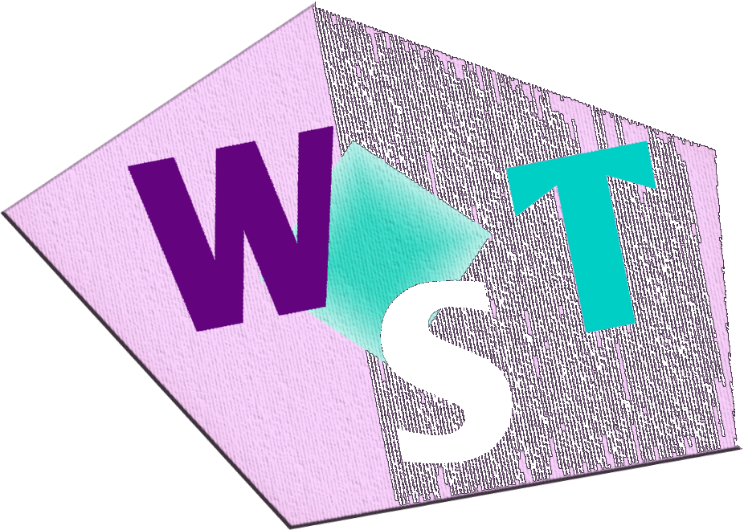

# Web static template

The main goal of Web static template is do everything that is possible statically.
In particular, internationalization and templating.
Why it matter? 

* First of all, it's better for performance and as a consequence it's better for users.
Сlient dosn't need do extra work in browser. All possible work is done when you build project
* It's reliable. You are 100% sure that everything is generated correctly, independently of the user's browsers
* It's better for indexing your pages by search engines
* Your content will be available even client block JavaScript

Also important principle is to provide developers choose his favorite 
instruments without imposing certain tools. Template support out of box Sass / Less / Stylus & 
Handlebars / Pug / Nunjucks & ES6 / TS (and many more) and you can add anything else with Gulp.

**Web static template is a good basis for your own template or even starter kit.**


Main features:
* Static i18n and templating
* Agnostic for preprocessors - Sass, Less, Stylus
* Agnosic templating - Pug, Handlebars, Nunjucks
* Full support ES6 and TypeScript
* Convenient work with images. Lossy and lossless optimization and resizes for HDPI & Retina
* Convenient and modern basic structure for sources (component orient system and support [CRP](https://developers.google.com/web/fundamentals/performance/critical-rendering-path))
* Minifying all resources (CSS, JS, HTML, images) for production
* Live-reloading
* Simple сustomize basic things in *settings.js* and great extensibility with Gulp

---

### Content:

[Installation and run](http://google.com)

[Basic structure](http://google.com)

[Step by step](http://google.com)

[Preprocessors](http://google.com)

[Templating](http://google.com)

[JavaScript](http://google.com)

[TypeScript](http://google.com)

[I18n](http://google.com)

[Work with images](http://google.com)

[Settings](http://google.com)

[Production build](http://google.com)

[Components implementation](http://google.com)

---

### Installation

* [Download](https://google.com) template
* In root of template run: *npm i*
* Than run: *npm install gulp-cli -g*
* Than run: *npm install gulp -D*
* In root of template run: *gulp*

---

### Basic structure

**Note:** you can change location and name of `src` or `dist` in `settings.js`

```shell
📁 Web static template 
   📁 src                        ⚪ All project code & images & fonts & other media content
      📁 basic                   ⚪ Basic/global styles and scripts
      📁 components              ⚪ All SCSS/JS/PHP components
      📁 criticalResources       ⚪ Resources for critical rendering path
      📁 libs                    ⚪ ❗ Some libraries included via ES6 exports or directly in html
      📁 resources               ⚪ Images & fonts & other media content
      📁 utils                   ⚪ All utilities
      📁 backend                 ⚪ Server side of poject. Include .htaccess file
      📄 index.php
      📄 index.js
      📄 index.scss
   📁 dist                       ⚪ Assembled project. Will be generated after running project
   📁 temp                       ⚪ Tempo Will be generated after running project
   📄 gulpfile.js
   📄 package.json
```

---

### Step by step

Get starting by creating example project:

#### 1. Install project:

* [Download](https://google.com) template
* In root of template run: *npm i*
* Than run: *npm install gulp-cli -g*
* Than run: *npm install gulp -D*
* In root of template run: *gulp*

#### 2. Create main page

* In `src/pages` create `index.html` (or `index.pug`, or `index.handlebars`)

`src/pages/index.html`

```html
<!DOCTYPE html>
<html>
  <head>
    <title> Main page </title>
  </head>
  <body class="mainPage">
    <h1> Hello world! </h1>
    <p> It's main page </p>
  </body>
</html>
```

#### 3. Create styles

* In `src` create *index.scss* (or `index.less`, or `index.styl`)

`src/index.scss`

```scss

.mainPage {
  padding: 0;
  background-color: pink;

  h1 {
    font-size: 30px;
  }
}

```

**Run *gulp* and see result.**

#### 4. Make some localization

* In `locales` create `en/mainPage.json` and `de/mainPage.json`

`locales/en/mainPage.json`

```json
{
  "title" : "Hello world!",
  "description" : "It's main page"
}
```

`locales/de/mainPage.json`

```json
{
  "title" : "Hallo Welt!",
  "description" : "Es ist die Hauptseite"
}
```

* In `settings.js` define locales:

`settings.js`

```js
module.exports = {
  //*** I18n ***//
  localesDir : 'locales',
  locales : ['en', 'de'],
  defaultLang : 'en',
}
```

* Add content to the page

`src/pages/index.html`

```html
<!DOCTYPE html>
<html>
  <head>
    <title> Main page </title>
  </head>
  <body class="mainPage">
    <h1> @{mainPage.title} </h1>
    <p> @{mainPage.description} </p>
  </body>
  </body>
</html>
```

#### 5. Build project

* Run: *gulp*
* Gulp generate to `dist` : `index.html` and `de/index.html`

`index.html`

```html
<!DOCTYPE html>
<html>
  <head>
    <title> Main page </title>
  </head>
  <body class="mainPage">
    <h1> Hello world! </h1>
    <p> It's main page </p>
  </body>
</html>
```

`de/index.html`

```html
<!DOCTYPE html>
<html>
  <head>
    <title> Main page </title>
  </head>
  <body class="mainPage">
    <h1> Hallo Welt! </h1>
    <p> Es ist die Hauptseite </p>
  </body>
</html>
```


#### Extra

##### Paths to resources

Additional languages of your project will build to subfolders. For example:

```shell
📁 dist
  📄 index.html
  📁 de
    📄 index.html
  📁 styles
    📄 index.css
  📁 scripts
    📄 index.js
  📁 images
    🍩 donut.png
```

So how you can solve path problem?

Create `paths.json` into locales folders. For example:

`locales/en/paths.json`

```json
{
  "baseDir" : ""
}
```

and

`locales/de/paths.json`

```json
{
  "baseDir" : ".."
}
```

Then add into `src/pages/index.html`

`src/pages/index.html`

```html
<!DOCTYPE html>
<html>
  <head>
    <title> Main page </title>
    <link rel="stylesheet" href="@{paths.baseDir}/styles/index.css">
  </head>
  <body class="mainPage">
    

    <script src="@{paths.baseDir}/scripts/index.js"></script>
  </body>
</html>
```

So, the problem is solved!

Also you can modify `paths` so:

`locales/en/paths.json`

```json
{
  "baseDir" : "",
  "styles" : "styles",
  "images" : "images",
  "scripts" : "scripts"
}
```

and

`locales/de/paths.json`

```json
{
  "baseDir" : "..",
  "styles" : "../styles",
  "images" : "../images",
  "scripts" : "../scripts"
}
```

Then add into `src/pages/index.html`

`src/pages/index.html`

```html
<!DOCTYPE html>
<html>
  <head>
    <title> Main page </title>
    <link rel="stylesheet" href="@{paths.styles}/index.css">
  </head>
  <body class="mainPage">
    

    <script src="@{paths.scripts}/index.js"></script>
  </body>
</html
```

#### Change interpolation delimiters

By default delimeters is *@{ }* for compatibility with Handlebars. But you can change it into `settings.js`

Examples:

```js
module.exports = {
  delimeters: ['#{', '}']
}
```

or

```js
module.exports = {
  delimeters: ['${', '}']
}
```

or what you want

---

### Preprocessors

Just create your-reprocessor file (.scss, .less, .styl) at `src` or `src/critical`.
These will be root files for your favorite preprocessor.
After runing or reruning project Gulp will compile your styles to `dist/styles`.

---

### Templating

Create your-template (Handlebars, Pug, Nunjucks) file at `src`. These will be root files for your favorite template engine.

**There is no separate path for partials, you can include your partials directly:**

Nunjucks inslude

```html
  <body>
    

    <section> Content </section>

    
  </body>
```

After runing or reruning project Gulp will compile yout html to `dist`.

---

### JavaScript

Web static template have full support ES6 (include ES6-modules) thanks to [webpack-stream](https://github.com/shama/webpack-stream).
Just create `index.js` in `src` or `critical.js` in `src/critical` and write your scripts.

---

### TypeScript

Create `index.ts` in `src` or `critical.ts` in `src/critical`. Then create `tsconfig.json` in `src`.
If you create `critical.ts` you also must create `tsconfig.json` in `src/critical`.

Example of `src/tsconfig.json` :

```json
{
    "files": [
        "./index.ts"
    ],
    "compilerOptions": {
        "noImplicitAny": true,
        "target": "es5"
    }
}
```

---

### I18n (internationalization)

For static i18n was chosen [gulp-i18n-localize](https://github.com/filaraujo/gulp-i18n-localize).
It allows you to generate all translations during project building.

#### Short example:

* In directory `locales` create `en` and `de` folder
* In `settings.js` define your locales and default lang:

```js
{
  locales : ['en', 'de'],
  defaultLang : 'en'
}
```

* Then create `content.json` in `en` and `de` directories
* Add some content to both `content.json`:

`locales/en/content.json`

```json
{
  "title": "Hello World!",
  "description" : "Let's create!"
}
```

`locales/de/content.json`

```json
{
  "title": "Hallo Welt!",
  "description" : "Lass uns erschaffen!"
}
```

* Then add conent to your html:

```html
<html>
  <head> </head>
  <body>
    <h1> @{conent.title} </h1>
    <p> @{conent.description} </p>
  </body>
<html>
```

When project will assembled `gulp-i18n-localize` will generate 2-lang versions:

`dist/index.html`

```html
<html>
  <head> </head>
  <body>
    <h1> Hello World! </h1>
    <p> Let's create! </p>
  </body>
<html>
```

and

`dist/de/index.html`

```html
<html>
  <head> </head>
  <body>
    <h1> Hallo Welt! </h1>
    <p> Lass uns erschaffen! </p>
  </body>
<html>
```

In `settings.js` your can define delimeters for interpolation.
By default delimeters is *@{ }* for compatibility with Handlebars.

**Full documentation you can find at [gulp-i18n-localize](https://github.com/filaraujo/gulp-i18n-localize) repository**.

---

### Work with images

One of the best features of template is work with images.
For all work it use two great tools: [gulp-imagemin](https://www.npmjs.com/package/gulp-imagemin) and
[ImageMagick](https://www.imagemagick.org/script/index.php).

#### Convert your images to webp

* Create folder `webp` in `src/resources/images`
* When gulp will building project all the images in this folder will converting to webp

**Gulp-webp will generating webp and source format (png, jpeg, gif) of 
images for [fallback](https://css-tricks.com/using-webp-images/)**.

Example:

```shell
📁 src
    📁 images
      📁 webp
        🍩 donut.png
        🌌 galaxy.jpg
```

will generate to:

```shell
📁 dist
    📁 images
      🍩 donut.webp
      🍩 donut.png
      🌌 galaxy.webp
      🌌 galaxy.jpg
```

**You can create as many sub-folders as you want**

Example:

```shell
📁 src
    📁 images
      📁 backgrounds
        🍩 donut.png
        📁 webp
          🌌 galaxy.jpg
    📁 icons
      ⛵ ship.png
      📁 webp
        🌍 earth.png
```

will generate to:

```shell
📁 dist
    📁 images
      🍩 donut.png
      ⛵ ship.png
      🌌 galaxy.webp
      🌌 galaxy.jpg
      🌍 earth.webp
      🌍 earth.png
```

#### Preparation HDPI & Retina images

Before start:
* Install [Image Magick](www.imagemagick.org/script/download.php)
* Reload terminal
* In `settings.js` set *hdpi : true* or *hdpiTotal : true* (for generate hdpi and regulat version for
all images) 

Then:
* Create folder `hdpi` in `src/resources/images`
* When gulp will building project all the images in this folder will have two versions: *images.png* 
and *image_0.5.png*

Example:

```shell
📁 src
    📁 images
      📁 hdpi
        🍩 donut.png
        🌌 galaxy.jpg
```

will generate to:

```shell
📁 dist
    📁 images
      🍩 donut.png
      🍩 donut_0.5.png
      🌌 galaxy.jpg
      🌌 galaxy_0.5.jpg
```

#### HDPI and Webp together

So, you want to convert come images to webp and want to have HDPI and normal version of those images.
Not problem, just create `webp` directory in `hdpi` folder or `hdpi` in `webp`.

Example:

```shell
📁 src
    📁 images
      📁 hdpi
        📁 webp
          🍩 donut.png
          🌌 galaxy.jpg
```

will generate to:

```shell
📁 dist
    📁 images
      🍩 donut.png
      🍩 donut_0.5.png
      🍩 donut.webp
      🍩 donut_0.5.webp
      🌌 galaxy.jpg
      🌌 galaxy_0.5.jpg
      🌌 galaxy.webp
      🌌 galaxy_0.5.webp
```

---

### Settings

Template provide for you some basic setting in order to save you from unnecessary actions with Gulp.

Here is a list of them:

```json
{
  //*** I18n ***//
  localesDir : 'locales',
  locales : ['en', 'de'],
  defaultLang : 'en',
  delimeters: ['@{', '}'], // Compatible with Handlebars and Pug

  //*** Structure, change free ***//
	src : './src',
	dist : './dist',

  ///*** Retina ***///
  /*
    Install:
    https://www.imagemagick.org/script/download.php
    before set hdpi : true or hdpiTotal : true
  */
  hdpi : false,
  hdpiTotal : false,

  //*** Image optimize ***//
  imagesOptimize : {
    lossless : false, // Set "lossless : false" to lossy сonversion

    jpg : {
      progressive : true,
      lossyQuality : 80
    },

    gif : {
      interlaced : true,
      lossyQuality : 80
    },

    png : {
      lossyQuality : 80
    },

    svgo : { // All plugins for SVGO - https://github.com/svg/svgo
      plugins: [
        { removeViewBox : true },
        { cleanupIDs : false }
      ]
    }
  }
};

```

---

### Production build

When you need producton build run: *gulp prod*.


##### The following things will be done:

* Styles/scripts/html minification
* Prefixes for styles. Last two version of browser by default
* Lossless or lossy images optimization

---

### Components implementation

So, we want create project maximally static and high performance, but also will pretty nice to 
have modern component system.

#### Let's create our first component. It's will be simple navigation component:

* Create component directory and all component parts like markup/style/script:

```shell
📁 src
    📁 components
      📁 navigation
        📄 navigation.html
        📄 navigation.scss
        📄 navigation.js
```

`src/components/navigation/navigation.html`

```html
  <nav class="navigation">
    <a href="work.html"> Work </a>
    <a href="contacts.html"> Contacts </a>
    <a href="about.html"> About </a>

    <button class="menuButton"> Menu </button>
  </nav>
```

`src/components/navigation/navigation.scss`

```scss
  .navigation {
    background-color: lightgrey;

    a {
      margin-right: 30px;
      padding: 10px 15px;
    }

    .menuButton {
      padding: 10px 15px;
    }
  }
```

`src/components/navigation/navigation.js`

```js
  var navigation = {
    setListeners() {
      document.querySelector('menuButton').addEventListener('click', navigation.openMenu);
    },

    openMenu() {
      // open menu function
    },

    init() {
      navigation.setListeners();
    }
  }

  export default navigation;
```

#### Then include your component to page/app:

* Include component markup to any page:

By default Web static template use Nunjucks for templating, so you can use includes:

`src/pages/index.html`

```html
<!DOCTYPE html>
<html>
  <head>
    <title> Main page </title>
  </head>
  <body class="mainPage">
    
  </body>
</html
```

* Include component styles to `scr/index.scss` or `scr/critical/styles/critical.scss`:

```scss
  @import 'src/components/navigation/navigation';
```

* Include and run component scripts to `scr/index.js` or `scr/critical/scripts/critical.js`:

```js
  import navigation from 'src/components/navigation/navigation';

  navigation.init();
```

So, now your component work!

---

Made with ♥ by [Sergey Pimenov](https://github.com/sergey-pimenov)

For all questions and suggestions, you can write to pimenov.web@gmail.com